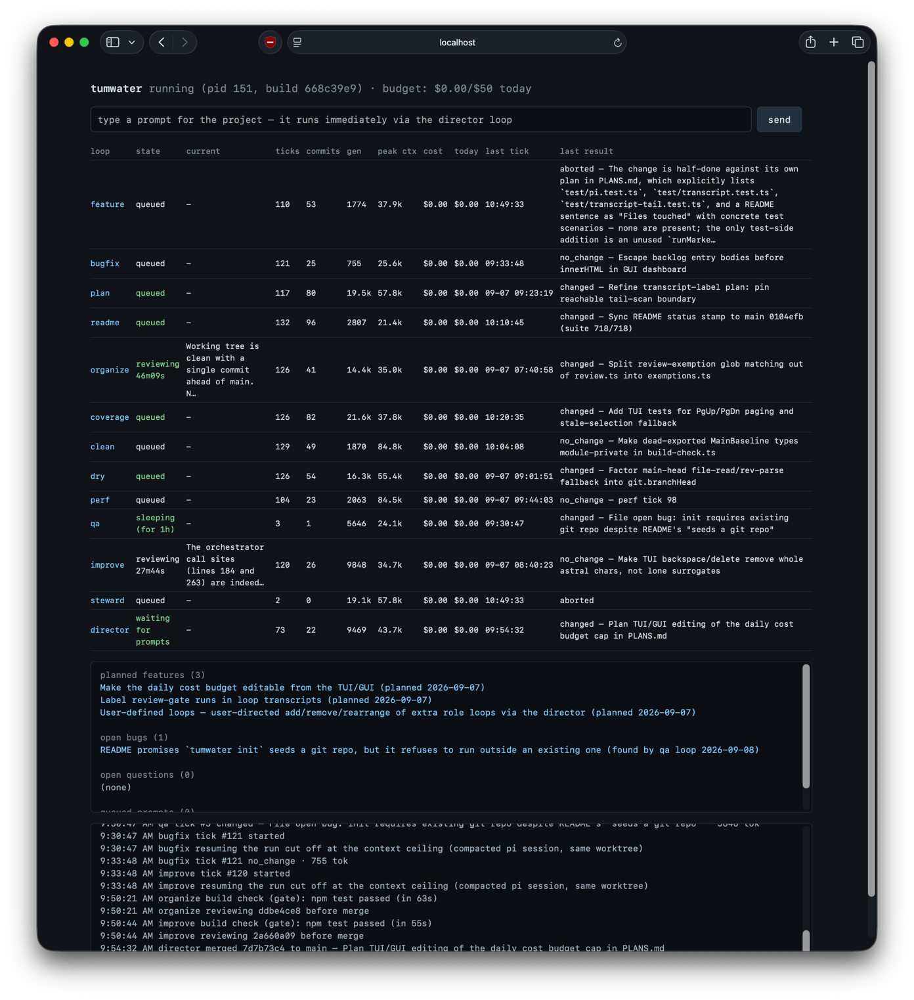

# tumwater

An opinionated autonomous development harness built on [pi](https://github.com/badlogic/pi-mono).
You write the initial prompt; a fleet of role-driven loops builds the project with immense effort.



## Initial prompt

<!-- tumwater:prompt:start -->
Idea: agentic harness

Opinionated. Built on pi. Lots of autonomous loops. You only write the markdown/initial prompt.
It builds the project with immense effort. First puts the initial prompt and project status into
README.md. Background loops are observable by gui/tui/log. GUI/TUI also gives user a main prompt.
Loop sleeps a while when the prompt results in no further changes. Starts again after a while to
see if the answer has changed due to the new state of the world. Each run attempts to find
something to do, do one thing, commit, merge to main. The find-something-to-do part is role
specific. Each loop has a role:

- Make the code more organized
- Increase unit test code coverage
- Make the code cleaner
- Make the code less repetitive
- Implement a planned feature (tracked in PLANS.md)
- Fix a bug (tracked in BUGS.md in repo)
- Plan a feature (write markdown plan, add to PLANS.md)
- Keep the README up to date
- Make an improvement to the code

Assumptions: run within a git repo dir. Each loop uses a persistent git workspace and branch.
Each loop keeps itself synced up with git main. Don't involve git remotes at all; do everything
locally and keep all project state within the git repo.
<!-- tumwater:prompt:end -->

## Status

<!-- tumwater:status:start -->
v0.1: working harness. `init`, `run`, `tui`, `gui`, `status`, `logs`, and `prompt` commands are
implemented with ten roles plus the director loop (absolute scheduling priority; routes
feature/bug requests into PLANS.md/BUGS.md, decomposing independent subparts). Loops persist
their pi sessions across ticks and self-heal from context overflows; merge conflicts get one
pi-driven resolution attempt; roles can override provider/model/thinking; `tumwater.json` is
validated on load/save with actionable errors; logs rotate and old pi sessions are pruned; the
TUI/status table is width-aware with a totals row; transient sleep/wake "predict stream timed
out" failures are retried once without dropping healthy sessions. Per-loop pi transcripts are
observable three ways: `tumwater logs --role <id>` (run separators, abbreviated thinking,
assistant text, tool calls; `-f` follows live), the TUI's activity pane (Ctrl+T cycles recent
events → each loop's transcript in place), and a click-to-toggle panel in the GUI
(`/api/transcript?role=&n=`). The quiet watchdog measures progress, not bytes — structural
events or real content growth keep a run alive, so zombie streams dripping empty keepalives are
killed instead of resetting it. Queued director prompts are re-queued if their tick fails without
landing work. No open bugs. In progress: ten PLANS.md plans await the feature loop — seven
from the Senior Tumwater report (PRINCIPLES.md injected into every prompt, an adversarial
review gate before merge, a refusal sentinel with friction signals, self-explaining commit
bodies, a QUESTIONS.md outbox, and slow-clock steward and QA roles), plus live-reloading
`tumwater.json` while running, absolute last-result timestamps in the GUI/TUI tables, and
open-bug/planned-feature lists in the TUI/GUI.
<!-- tumwater:status:end -->

## How it works

`tumwater init "<prompt>"` seeds a git repo with README.md (your prompt + a status section),
PLANS.md, BUGS.md, and tumwater.json, and commits them. `tumwater run` then starts one loop
per enabled role. Every loop tick:

1. Resets its persistent worktree (`.tumwater/worktrees/<role>`, branch `tumwater/<role>`) to main.
2. Builds a role-specific "find something to do" prompt and runs `pi --print --mode json` in the
   worktree, resuming the loop's own pi session from earlier ticks (`--continue`) so context
   carries over; pi auto-compacts when it nears the model's window.
3. If pi changed files: commits, merges main into the branch, and fast-forwards main — all under a
   merge lock shared by every loop. If pi found nothing to do, the loop backs off (exponentially,
   capped) and sleeps.
4. Sleeping loops wake early when main moves — the world changed, so the answer may have changed.

The director loop is special: it executes prompts you type into the TUI (or `tumwater prompt`),
queued in a file-based inbox. It always has priority — a queued prompt starts immediately,
outside the `maxConcurrent` limit and ahead of every role loop, and queued prompts run back to
back with no cooldown between them. Everything is local git; no remotes are ever touched. Runtime state
lives in `.tumwater/` (gitignored); durable state (plans, bugs, status, config) lives in tracked
markdown and `tumwater.json`.

## Usage

```
npm install && npm run build

cd your-project        # any git repo
tumwater init "Build a tiny markdown-to-html converter CLI in Python."
tumwater run          # terminal 1: the loops (Ctrl+C to stop)
tumwater tui          # terminal 2: dashboard + main prompt
tumwater gui          # or the same dashboard at http://127.0.0.1:7180
tumwater status       # one-shot table
tumwater logs -f      # follow harness events
tumwater logs --role feature   # that loop's pi transcript (also supports -f, -n N)
tumwater prompt "prefer no third-party deps"
```

Roles: `feature`, `bugfix`, `plan`, `readme`, `organize`, `coverage`, `clean`, `dry`, `perf`,
`improve`, `director`. Enable/disable them, pick pi's provider/model/thinking level, and tune
backoff in `tumwater.json`.

## Notes on local model servers

- **LM Studio WARN flood** (`Reasoning setting 'high' is not supported by model '…'. Supported
  settings: 'on', 'off'. Falling back to reasoning setting 'on'.`): benign. pi requests its
  configured thinking level per turn; GGUF models that only expose an on/off reasoning toggle make
  LM Studio warn and fall back to `on`. Reasoning stays enabled; no tumwater or pi change needed.
  To silence it, set a thinking level the model supports (or none) in `tumwater.json` / pi settings.
- **"terminated" tick errors after ~20 minutes**: pi's HTTP client (undici) applies an idle
  timeout (`httpIdleTimeoutMs` in pi's settings.json, default 300000 = 5 min) to both response
  headers and gaps between body chunks. A local server prefilling a large context under
  concurrent load can take longer than that to stream its first byte, so the request is severed
  ("terminated"), pi's retries die the same way, and the tick fails after ~4 × 5 min. Fix: set
  a large-but-finite `"httpIdleTimeoutMs"` (e.g. `1800000` = 30 min) in
  `~/.pi/agent/settings.json`. Do not use `0` (fully disabled): a zombie socket then waits
  forever. The harness's `quietTimeoutSeconds` watchdog (default 30 min; kills a run when no
  *progress* — structural events or actual content growth — happens, so content-free keepalives
  cannot reset it) and `tickTimeoutSeconds` remain the layered hang guards.
- **Context accounting**: declare an honest `contextWindow` for the model in pi's `models.json` —
  it is what triggers pi's auto-compaction. With LM Studio's unified KV cache, concurrent requests
  share one context pool (declare pool ÷ slots); with unified KV off, each slot owns the full
  window. A session that overruns the server's real limit fails with "Context size has been
  exceeded"; the harness detects this and starts that loop a fresh session.
- **Match clients to slots, or prefix caches thrash**: each server slot keeps the KV prefix of
  the last request it served. Keep the number of concurrent tumwater clients — `maxConcurrent`
  plus one for the director's bypass — at or below the server's slot count. One client over, and
  slots keep evicting each other's session prefixes: with persistent multi-10k-token sessions,
  nearly every turn re-prefills from scratch (minutes each), requests queue behind those
  prefills, and starved ticks die as "no pi progress" watchdog kills even though the server is
  healthy. Symptom to look for: small-context requests timing out while the server log shows
  continuous back-to-back prompt processing.
- **KV memory with dedicated slots**: unified-off KV buffers are allocated per slot — for a 27B
  model, 4 × 262144-token slots cost ~100 GB of KV on top of the weights (~115 GB total), which
  runs a 128 GB machine at the edge: heavy swapping, and the engine can wedge permanently in
  `PROCESSINGPROMPT` (predictions hang, API reports "Engine protocol predict request failed:
  fetch failed", `lms ps` shows a phantom prefill). Bounce it with `lms unload <model>` +
  `lms load <model> --context-length N --parallel K`, and size N×K to leave real headroom
  (e.g. 131072 × 4 ≈ 66 GB total for this model).

## Development

```
npm test               # build + unit tests (node:test)
```

Layout: `src/` harness code (`loop.ts` is the tick lifecycle, `orchestrator.ts` the scheduler,
`pi.ts` the pi subprocess integration, `git.ts` the worktree/merge machinery), `test/` unit tests.
Tests fake pi with a shell shim on PATH, so they run offline.
